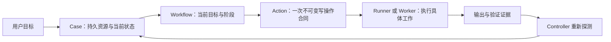
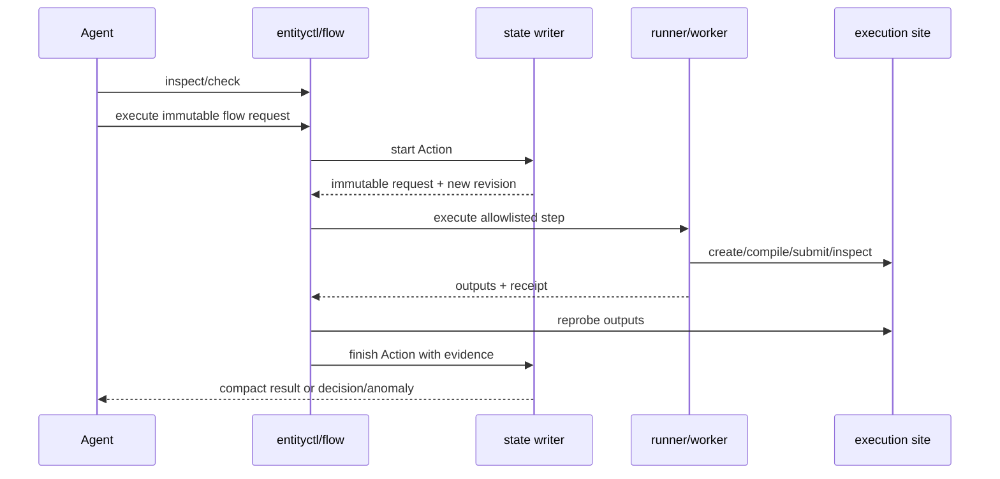

# Entity Router 当前架构说明

日期：2026-07-19
范围：`entity-skills` 当前源码与生产 bundle
目的：客观解释当前架构，作为后续简化设计的讨论基础；本文不提出目标架构。

## 1. 一句话概括

Entity Router 是一个位于 Agent 与本地/远端 Entity 工作区之间的控制面：它在控制机保存模拟任务的权威状态，通过不可变身份、站点与路径约束、单写事务和证据校验，协调 PGen、源码传输、编译、运行、数据读取与分析。

当前架构由两代设计叠加而成：

1. **Router v3 状态机**：`Case -> Workflow -> Action -> Worker`，提供多站点资源图、不可变身份和严格写入门禁。
2. **v4 公共入口与 deterministic flow**：在 v3 之上增加项目发现、共享安装、actor provenance、writer lease、紧凑查询和批量执行 façade，减少 Agent 手工驾驶底层命令。

v4 没有替换 v3，而是把它包在更高一层。因此，当前系统同时存在“高层公共入口”和“低层状态原语”。

## 2. 整个 `entity-skills` 产品的边界

当前仓库统一发布四个 skill：

| Skill | 主要职责 | 不负责什么 |
|---|---|---|
| `entity-router` | Case 控制、跨阶段编排、源码传输、运行、恢复和证据提交 | 不直接决定 PGen 物理设计，不承担 nt2py API 知识库 |
| `entity-pgen` | PGen、匹配 TOML、`docs/design.md` 及科学实现一致性 | 不管理构建、调度器和 Case 状态 |
| `entity-env-build` | 依赖环境、兼容性检查、构建计划和编译结果 | 不选择模拟物理参数，不提交正式模拟作业 |
| `entity-nt2py` | Entity 输出读取、检查、可视化和导出 | 不拥有 Router 状态，也不替代科学判断 |

边界明确的单阶段只读或 standalone 工作可以直接进入 owner skill。只要任务涉及持久 Case、跨阶段交接、远端执行、下游失效或受管写入，就由 Router 统一控制。

## 3. 五类权威事实分别存在哪里

当前架构刻意不把所有内容放在同一个目录。

| 位置 | 保存的权威事实 | 明确不保存 |
|---|---|---|
| 项目 Git | PGen、TOML、设计文档和可审查源码 | mutable Case 状态、Agent 会话、raw data |
| `~/.entity-router` | Case、Workflow、Action、事件、站点、项目绑定和最后验证证据 | 完整远端产物和 raw data |
| 执行站点 | source snapshot、build、run、scheduler receipt、raw data、analysis artifact | controller Case 状态 |
| `~/.entity-skills` | 内容寻址的 skill bundle、当前版本选择器、运行观测 trace | 科学项目状态和第二套 Case |
| Agent 客户端目录 | 指向当前 bundle 的 skill 投影 | 各自独立维护的 Router 或 Case 副本 |

这套分工的核心是：**科学事实进入项目 Git，控制事实留在控制机，计算产物留在执行站点，skill 版本单独发布。**

控制区大致如下：

```text
~/.entity-router/
├── registry.json
├── project-bindings.json
├── sites/<site_id>.json
└── cases/<case_uid>-<label>/
    ├── case.json
    ├── events.jsonl
    ├── actions/<action_id>/
    │   ├── request.json
    │   └── result.json
    ├── history/
    └── evidence/
```

`case.json` 是当前控制快照，`events.jsonl` 是追加式历史，Action request/result 是一次写操作的合同与结果。远端 Worker 不允许直接写这个目录。

## 4. 多站点资源模型

Router 不把一个模拟任务理解成“一个目录”，而是理解成分布在不同站点上的资源图。

### 4.1 Site

一个 Site 表示一个访问边界，例如本机、HPC 登录节点及其共享文件系统。Site profile 记录：

- local 或 SSH transport；
- SSH alias；
- scheduler 类型；
- source、build、run、dependency、staging 和 analysis root。

认证信息不进入 Site profile。

### 4.2 Locator

所有受管路径都必须同时包含站点和绝对路径：

```json
{"site_id": "pi2-v100", "path": "/lustre/.../runs/..."}
```

CLI 中写作：

```text
pi2-v100:/lustre/.../runs/...
```

因此，“同一个字符串路径”并不足以确定资源，站点也是身份的一部分。

### 4.3 Source authority

每个 Case 只有一个可编辑源码 authority。其他 checkout 只能是 replica，不能因为内容看起来较新就自动成为权威。

源码进入构建站点有四种模式：

- `git-ref`：精确 commit；
- `snapshot`：把 dirty/untracked 工作树冻结为带 manifest hash 的不可变快照；
- `shared`：验证共享文件系统映射；
- `external`：验证用户维护的外部副本。

mutable rsync 或 tar 只是一种传输方式，不能独立成为 source identity。

## 5. Case 保存什么

Case 是一个模拟目标的持久控制记录。它主要包含五类内容。

### 5.1 Case identity 与 memory

- 不可变 `case_uid`；
- 可读标签 `case_id`；
- goal、done-when、约束、已确认决策、open questions；
- Case 当前状态和更新时间。

### 5.2 Resource graph

资源链为：

```text
source -> build -> run -> data -> analysis
```

其中：

- build identity 引用精确 source revision；
- run identity 引用精确 build identity；
- data identity 引用精确 run 和数据 inventory；
- analysis identity 引用精确 data identity。

历史 identity 保留，`current_id` 只选择当前使用的一个身份。

### 5.3 Readiness

Case 为 source、PGen、build、run、data 和 analysis 保存紧凑 readiness，例如：

```text
source=ready
pgen=verified
build=pass
run=prepared/submitted/running/completed
data=unknown/partial/ready/corrupt
analysis=none/stale/complete
```

readiness 不是叙述性判断，必须有证据支持。上游变化会使下游状态失效：源码变化使 build/run stale，build 变化使未启动 run stale，数据变化使 analysis stale。

### 5.4 Workflow

Workflow 描述 Case 当前正在完成的目标，包括：

- workflow ID 和 type；
- structured target 及其 hash；
- 当前 phase 和 owner；
- active Action；
- allowed actions、blockers 和 next action。

Workflow 是长期目标与单次 Action 之间的一层状态。

### 5.5 Writer lease

Case 可以保存短期 writer lease，避免多个 Agent 同时推进同一个 Workflow。lease 绑定 actor run ID，支持 acquire、handoff、release 和过期恢复。

文件锁与 expected revision 仍然是实际写入门；lease 是多 Agent 协调层，不是第二个 writer。

## 6. `Case -> Workflow -> Action -> Worker`



### Case

保存跨会话、跨 Agent、跨站点仍需持续存在的控制事实。

### Workflow

表示当前要完成的一条生命周期目标，例如构建并运行、恢复现有模拟或分析数据。

### Action

表示一次具体的受管变更。Action request 在开始后不可修改，包含：

- action type；
- owner 和 execution domain；
- execution site；
- inputs、read roots、write roots 和 protected paths；
- resource bindings；
- expected outputs 和 acceptance checks；
- identity、parent identity、spec hash；
- actor 和 flow provenance。

一个 Case 同时只允许一个 mutating Action active。

### Runner / Worker

当前有两种执行方式：

1. **deterministic runner**：运行 allowlist 中的固定程序，不接受任意 shell 字符串；
2. **model Worker**：用于 PGen 或科学分析等需要判断的工作，只接收 Action request、owner skill/playbook 和精确 Locator。

Worker 的成功叙述不能直接推进 Case。Controller 必须重新探测输出并完成 Action。

## 7. 当前公共入口与内部原语

### 7.1 `entityctl` 公共入口

普通 Agent 被要求优先使用：

| 命令 | 用途 |
|---|---|
| `entityctl doctor` | 检查共享控制区和 skill bundle |
| `entityctl bundle install` | 发布一个内容寻址的统一 bundle |
| `entityctl project bind/resolve/list/unbind` | 项目与 Case 的本地公共映射 |
| `entityctl inspect` | 读取不超过约 4 KiB 的 controller-local Case 摘要 |
| `entityctl run-status` | 从 Case 推导 active run 并做一次远端状态探测 |
| `entityctl writer ...` | 多 Agent 写入 lease 生命周期 |
| `entityctl flow inspect/check/execute/watch` | deterministic flow façade |

`inspect` 不访问远端、不写 Case。`run-status` 是一次性只读路径，也不创建 Action。

### 7.2 内部安全原语

底层仍保留：

- `entity_router_state.py`：唯一 Case writer；
- `entity_router_site.py`：站点注册、探测和 source materialization；
- `entity_router_project.py`：项目绑定；
- `entity_router_flow.py`：flow 验证、执行、恢复和 watch；
- `entity_router_flow_runners.py`：固定 runner；
- `entity_router_status.py`：一次性 scheduler/PID/log/data 状态探测；
- `entity_router_purge.py`：显式授权的数据删除执行器。

当前文档仍保留直接调用 `start-action`、`finish-action`、`refresh`、`reconcile`、migration 等底层命令的说明，主要用于兼容、诊断和恢复。

## 8. Deterministic flow 如何工作

flow request 是一个不可变 JSON，请求包含 Case、base revision、workflow target hash 和一组有顺序的 steps。

执行过程如下：



flow 会拒绝：

- target hash 漂移；
- Case revision 漂移；
- Action ID 与其他 flow 冲突；
- Action history 不连续；
- owner/domain 不匹配；
- wrong-site 或越界路径；
- 任意 shell 字段；
- 没有证据的 scheduler 重放。

当前 runner allowlist 包含：

| Runner | 对应 Action | 作用 |
|---|---|---|
| `source.materialize.v1` | `source.materialize` | 冻结或物化精确源码 |
| `build.plan.v1` | `build.plan` | 生成和验证构建计划 |
| `build.compile.v1` | `build.compile` | 编译并验证 executable |
| `run.prepare.v1` | `run.prepare` | 创建 immutable run root、input 和 manifest |
| `run.launch.v1` | `run.launch` | Slurm/PID 启动和 launch receipt |
| `run.monitor.v1` | `run.monitor` | 持续观察并收口 terminal 状态 |
| `data.inspect.v1` | `data.inspect` | 生成 nt2py inventory 和 data identity |
| `model.worker.v1` | owner Action | 为需要模型判断的步骤准备和恢复 Worker envelope |

## 9. 一次正式模拟的阶段

典型流程是：

```text
确定/修改 PGen 与 TOML
  -> 冻结 source revision
  -> build.plan
  -> build.compile
  -> run.prepare
  -> run.launch
  -> run.status 或 run.monitor
  -> data.inspect
  -> analysis.run
```

其中：

- `run.prepare` 只负责不可变 run identity、输入和 manifest；
- `run.launch` 才负责正式 scheduler/PID 副作用；
- `run.status` 是轻量只读查询；
- `run.monitor` 是需要持久记录和 terminal 收口的 Action；
- `data.inspect` 负责数据可读性和 identity，不负责科学结论；
- `analysis.run` 可以使用 model Worker。

## 10. 外部副作用与恢复

提交 scheduler 作业不能像普通文件写入一样盲目重试。当前 `run.launch.v1` 使用 dispatch receipt：

```text
intent_written -> effect_observed -> outputs_verified
```

Slurm job name/comment 包含 deterministic identity。若进程在 `sbatch` 后、receipt 完成前中断，恢复逻辑按 job name、user、提交时间窗口、run root 和 comment 查询 scheduler：

- 恰好一个匹配：认领原作业，不再次提交；
- 没有匹配：在恢复协议证明无副作用后才允许重试；
- 多个匹配：返回 anomaly，不猜测。

非 scheduler 进程使用 PID、`/proc` start ticks 和 run root 防止 PID 复用误认。

flow 自身还利用 Case revision、Action request/result 和 receipt 判断已完成、active、冲突或可恢复步骤。

## 11. 多 Agent、版本与观测

### 11.1 统一 bundle

四个 skill 由一个仓库统一发布。`entityctl bundle install` 创建内容寻址 bundle，并把 Codex、Claude Code 和 Kimi Code 的 discovery 目录投影到同一个 `~/.entity-skills/current`。

当前源码核心文件与生产 bundle `ea3d59bc...` 一致。

### 11.2 Actor provenance

每次 mutation、Action request/result 和 event 可以记录：

- Agent run ID；
- provider/client/session/model；
- skill bundle hash。

这些字段用于审计，不保存隐藏 reasoning，也不改变科学证据等级。

### 11.3 Observability trace

`tools/skill_observability` 记录工具调用、artifact、hash、大小、顺序和平台 usage。trace 是执行证据，不是第二套 Case 或 readiness 状态。

## 12. 当前已经实现的部分

截至当前源码与生产 bundle：

- Case v3 多站点 Locator 和 immutable identity；
- controller single-writer、expected revision、文件锁；
- project -> Case 公共绑定；
- Codex/Claude/Kimi 统一内容寻址 bundle；
- actor provenance 和 writer lease/handoff；
- `entityctl inspect` 和一次性 `run-status`；
- flow inspect/check/execute/watch；
- allowlisted deterministic runner 和本地执行路径；
- local fake Slurm launch recovery；
- Linux PID identity 保护逻辑；
- model Worker prepare/resume；
- data inventory identity；
- 显式授权、带 receipt 的 raw-data purge；
- Python 3.6 兼容和合同/回归测试。

## 13. 当前仍不完整或存在缺陷的部分

以下边界在当前实现中仍然存在：

1. **SSH deterministic runner 未完整接通**
   Source materialization 已有远端路径，其他 deterministic flow 的本地核心路径也已实现；但真实 SSH build/run/nt2/Worker staging 与 live recovery 仍未完成。远端实践可能退回 Worker 或低层 Action 路径。

2. **高层写入口仍要求 Agent 构造 flow**
   `entityctl flow execute` 虽然能批量执行，但调用者仍需准备 flow request、step、Action ID、owner/domain、Locator、binding、hash 和验收条件。

3. **高层与低层路径并存**
   公共 façade、deterministic flow、legacy loop 和直接 state CLI 同时存在。不同场景可能进入不同合同。

4. **Action 完成不是跨文件原子事务**
   当前 `finish-action` 会先写 Action result，再更新 Case 和 event。后续校验失败或进程中断可能留下 terminal result 与 active Action 并存的异常。

5. **缺少通用的受支持异常收敛路径**
   flow 可以恢复属于同一 flow 的正常中断，但 legacy Action 或 `ACTION_RESULT_ON_ACTIVE` 目前没有统一、公开、幂等的修复入口。

6. **Site policy 预检能力有限**
   Site profile 主要保存 transport、scheduler 和路径，还不能完整表达集群的 CPU/GPU、partition、QoS、walltime 和 GRES 政策。

7. **部分“已实现”只完成了本地验证**
   launch recovery、watch、部分 runner 和 model-efficient 指标有本地测试，但不能等同于真实 SSH/HPC 端到端验收。

## 14. 为什么当前架构显得复杂

复杂度并非来自单一模块，而是六类关注点叠加：

| 层次 | 要解决的问题 | 引入的概念 |
|---|---|---|
| 多站点资源 | 本机、HPC 和 raw data 不在同一目录 | Site、Locator、authority、replica |
| 生命周期状态 | source/build/run/data/analysis 互相依赖 | Case、identity、readiness、stale propagation |
| 写入安全 | 防止并发、越界和错误完成 | revision、lock、lease、Action contract |
| 外部副作用 | 防止重复编译、提交和删除 | receipt、intent/effect/verified、reprobe |
| 模型分工 | 固定步骤不反复消耗模型上下文 | flow、runner、Worker envelope |
| 多客户端产品 | Codex/Claude/Kimi 共享状态和版本 | bundle、binding、actor、trace |

每一层都有现实原因，但目前这些概念的一部分仍直接暴露给主 Agent。尤其是受管写入，Agent 不只描述目标，还需要手工组装控制面细节。

另一个原因是兼容性：v4 没有替换 v3，而是在 v3 上增加 façade；deterministic flow 又没有完全覆盖 SSH 路径，所以旧路径暂时不能删除。

## 15. 当前架构中的关键边界

后续无论如何简化，首先需要看清当前系统依赖的边界：

1. 项目 Git、controller state、远端 artifact 和 skill bundle 是四种不同权威。
2. Source/build/run/data/analysis 组成可追溯的 identity chain。
3. Controller 是唯一状态 writer；远端只返回 artifact 和 evidence。
4. 文件存在不等于操作成功，成功必须经过重新探测和验收。
5. scheduler submit、进程启动和数据删除属于不可盲重放的外部副作用。
6. 科学判断与确定性编排是两种不同工作，不能用同一种执行器完全替代。

这些边界与当前公开接口、状态对象的数量并不是同一件事。保留边界不必等于保留所有当前操作概念。

## 16. 后续思考架构时需要回答的问题

下面的问题用于评估未来方案，不代表本文已经选择答案：

1. 普通用户和主 Agent 最少需要理解哪些概念？
2. Workflow 是否必须作为独立持久对象，还是可以从目标和 Operation 推导？
3. Action 是否是公共操作单位，还是只应是内部 journal step？
4. writer lease、actor、revision、binding 和 hash 能否全部由一个高层入口派生？
5. 正常执行与恢复是否应使用同一个幂等命令？
6. owner skill 应获得多大自由，Router 只需要验证哪些边界？
7. SSH 执行应复制本地 runner，还是通过一个统一远端 executor 承载？
8. 哪些旧 Case/legacy Action 必须长期兼容，哪些可以一次性迁移后删除旧路径？
9. 用户真正需要确认的是物理与资源决策，还是也需要确认控制面细节？
10. 当前多个 schema 和 result/receipt/state 文件中，哪些是独立事实，哪些只是重复表达？

## 17. 阅读当前实现的建议顺序

如果要继续研究当前架构，建议按以下顺序阅读：

1. [`skills/entity-router/SKILL.md`](../skills/entity-router/SKILL.md)：当前 Agent 行为合同；
2. [`design/architecture-v4.md`](architecture-v4.md)：共享控制区、多客户端和公共入口；
3. [`design/model-efficient-router-flow.md`](model-efficient-router-flow.md)：deterministic flow、runner 和恢复设计；
4. [`skills/entity-router/references/workspace-layout.md`](../skills/entity-router/references/workspace-layout.md)：多站点资源边界；
5. [`skills/entity-router/references/router-runtime.md`](../skills/entity-router/references/router-runtime.md)：当前完整 CLI；
6. [`skills/entity-router/scripts/entityctl.py`](../skills/entity-router/scripts/entityctl.py)：公共 façade；
7. [`skills/entity-router/scripts/entity_router_flow.py`](../skills/entity-router/scripts/entity_router_flow.py)：flow 编排；
8. [`skills/entity-router/scripts/entity_router_state.py`](../skills/entity-router/scripts/entity_router_state.py)：Case 唯一写入者；
9. [`skills/entity-router/scripts/entity_router_flow_runners.py`](../skills/entity-router/scripts/entity_router_flow_runners.py)：固定执行器与 receipt。

## 18. 总结

当前 Entity Router 已经建立了一套较完整的安全控制面：权威边界清楚，资源和身份可追溯，多 Agent 共享同一状态，固定操作可以由程序执行，危险外部副作用有恢复证据。

它的主要问题也很明确：**底层安全模型、高层执行模型和兼容路径同时存在，而且高层写操作尚未真正隐藏底层细节。** 当前架构已经减少了查询成本，但还没有把“执行一个模拟目标”收敛成简单的公共操作。

因此，后续架构讨论需要区分两件事：

- 哪些安全边界确实必须保留；
- 哪些状态对象、命令和参数只是当前实现方式，可以隐藏、派生或合并。

这也是评估“简化”是否真正有效的基准。
