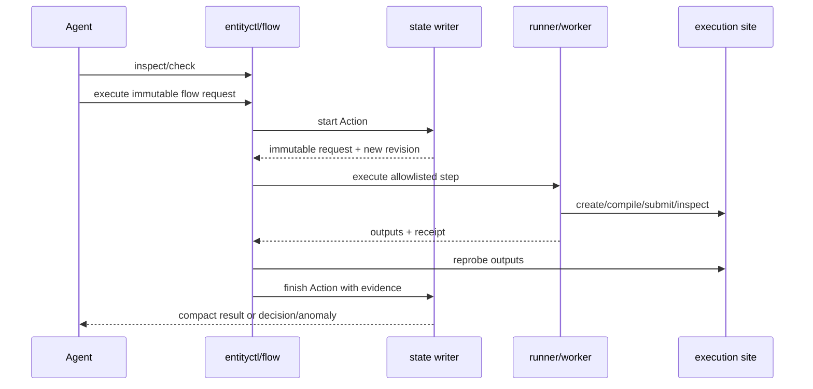

# Current Entity Router Architecture

Date: 2026-07-19
Scope: current source code and production bundle of `entity-skills`
Purpose: objectively explain the current architecture as the basis for discussing a subsequent simplified design; this document does not propose a target architecture.

## 1. One-sentence summary

Entity Router is a control plane sitting between the Agent and local/remote Entity workspaces: it keeps the authoritative state of simulation tasks on the control machine and, through immutable identities, site and path constraints, single-writer transactions, and evidence validation, coordinates PGen, source transfer, builds, runs, data reads, and analysis.

The current architecture is the result of two generations of design stacked together:

1. **Router v3 state machine**: `Case -> Workflow -> Action -> Worker`, providing a multi-site resource graph, immutable identities, and strict write gating.
2. **v4 public entry points and deterministic flow**: adds project discovery, shared installation, actor provenance, writer leases, compact queries, and a batch execution façade on top of v3, reducing the Agent's manual driving of low-level commands.

v4 did not replace v3; it wraps it at a higher layer. Therefore the current system has both "high-level public entry points" and "low-level state primitives" at the same time.

## 2. Boundaries of the whole `entity-skills` product

The current repository ships four skills together:

| Skill | Primary responsibility | What it does not do |
|---|---|---|
| `entity-router` | Case control, cross-phase orchestration, source transfer, runs, recovery, and evidence submission | Does not directly decide PGen physics design, does not carry the nt2py API knowledge base |
| `entity-pgen` | PGen, matching TOML, `docs/design.md`, and scientific implementation consistency | Does not manage builds, schedulers, or Case state |
| `entity-env-build` | Dependency environment, compatibility checks, build plans, and compile results | Does not choose simulation physics parameters, does not submit formal simulation jobs |
| `entity-nt2py` | Reading, inspecting, visualizing, and exporting Entity output | Does not own Router state, and does not replace scientific judgment |

Single-phase read-only or standalone work with clear boundaries can enter the owner skill directly. Whenever a task involves a persistent Case, cross-phase handoff, remote execution, downstream invalidation, or managed writes, the Router takes unified control.

## 3. Where the five kinds of authoritative facts live

The current architecture deliberately does not put everything in a single directory.

| Location | Authoritative facts stored | Explicitly not stored |
|---|---|---|
| Project Git | PGen, TOML, design documents, and reviewable source code | Mutable Case state, Agent sessions, raw data |
| `~/.entity-router` | Cases, Workflows, Actions, events, sites, project bindings, and last-verified evidence | Complete remote artifacts and raw data |
| Execution site | Source snapshots, builds, runs, scheduler receipts, raw data, analysis artifacts | Controller Case state |
| `~/.entity-skills` | Content-addressed skill bundles, current-version selector, run observability traces | Scientific project state and a second set of Cases |
| Agent client directories | Skill projections pointing at the current bundle | Independently maintained Router or Case copies |

The core of this division of labor is: **scientific facts go into project Git, control facts stay on the control machine, compute artifacts stay on the execution site, and skill versions are published separately.**

The control area looks roughly like this:

```text
~/.entity-router/
├── registry.json
├── project-bindings.json
├── sites/<site_id>.json
└── cases/<case_uid>-<label>/
    ├── case.json
    ├── events.jsonl
    ├── actions/<action_id>/
    │   ├── request.json
    │   └── result.json
    ├── history/
    └── evidence/
```

`case.json` is the current control snapshot, `events.jsonl` is the append-only history, and Action request/result is the contract and outcome of one write operation. Remote Workers are not allowed to write this directory directly.

## 4. Multi-site resource model

The Router does not understand a simulation task as "one directory"; it understands it as a resource graph distributed across different sites.

### 4.1 Site

A Site represents an access boundary, for example the local machine, or an HPC login node and its shared file system. A Site profile records:

- local or SSH transport;
- SSH alias;
- scheduler type;
- source, build, run, dependency, staging, and analysis roots.

Authentication information does not enter the Site profile.

### 4.2 Locator

Every managed path must contain both the site and the absolute path:

```json
{"site_id": "pi2-v100", "path": "/lustre/.../runs/..."}
```

Written on the CLI as:

```text
pi2-v100:/lustre/.../runs/...
```

Therefore, "the same string path" is not enough to identify a resource; the site is part of the identity.

### 4.3 Source authority

Each Case has exactly one editable source authority. Other checkouts can only be replicas; they cannot automatically become authoritative just because their content looks newer.

There are four modes for source code to reach a build site:

- `git-ref`: an exact commit;
- `snapshot`: freezes a dirty/untracked work tree into an immutable snapshot with a manifest hash;
- `shared`: verifies a shared file system mapping;
- `external`: verifies a user-maintained external copy.

A mutable rsync or tar is only a transfer mechanism; it cannot independently become a source identity.

## 5. What a Case stores

A Case is the persistent control record of a simulation goal. It mainly contains five kinds of content.

### 5.1 Case identity and memory

- immutable `case_uid`;
- human-readable label `case_id`;
- goal, done-when, constraints, confirmed decisions, open questions;
- the Case's current state and update time.

### 5.2 Resource graph

The resource chain is:

```text
source -> build -> run -> data -> analysis
```

Where:

- build identity references an exact source revision;
- run identity references an exact build identity;
- data identity references an exact run and data inventory;
- analysis identity references an exact data identity.

Historical identities are retained; `current_id` only selects the identity currently in use.

### 5.3 Readiness

A Case stores compact readiness for source, PGen, build, run, data, and analysis, for example:

```text
source=ready
pgen=verified
build=pass
run=prepared/submitted/running/completed
data=unknown/partial/ready/corrupt
analysis=none/stale/complete
```

Readiness is not a narrative judgment; it must be backed by evidence. Upstream changes invalidate downstream state: a source change makes build/run stale, a build change makes unstarted runs stale, and a data change makes analysis stale.

### 5.4 Workflow

A Workflow describes the goal the Case is currently completing, including:

- workflow ID and type;
- structured target and its hash;
- current phase and owner;
- active Action;
- allowed actions, blockers, and next action.

A Workflow is a layer of state between the long-term goal and a single Action.

### 5.5 Writer lease

A Case can hold a short-term writer lease to prevent multiple Agents from advancing the same Workflow simultaneously. The lease binds an actor run ID and supports acquire, handoff, release, and expiry recovery.

File locks and expected revisions remain the actual write gate; the lease is a multi-Agent coordination layer, not a second writer.

## 6. `Case -> Workflow -> Action -> Worker`


### Case

Stores the control facts that must persist across sessions, Agents, and sites.

### Workflow

Represents one lifecycle goal currently being completed, such as build and run, recovering an existing simulation, or analyzing data.

### Action

Represents one concrete managed change. An Action request cannot be modified after it starts, and contains:

- action type;
- owner and execution domain;
- execution site;
- inputs, read roots, write roots, and protected paths;
- resource bindings;
- expected outputs and acceptance checks;
- identity, parent identity, spec hash;
- actor and flow provenance.

A Case allows only one mutating Action to be active at a time.

### Runner / Worker

There are currently two execution modes:

1. **deterministic runner**: runs fixed programs from an allowlist and does not accept arbitrary shell strings;
2. **model Worker**: used for work requiring judgment, such as PGen or scientific analysis; it receives only the Action request, the owner skill/playbook, and exact Locators.

A Worker's success narrative cannot directly advance the Case. The Controller must re-probe the outputs and finish the Action.

## 7. Current public entry points and internal primitives

### 7.1 `entityctl` public entry points

Ordinary Agents are required to prefer:

| Command | Purpose |
|---|---|
| `entityctl doctor` | Checks the shared control area and skill bundle |
| `entityctl bundle install` | Publishes one content-addressed unified bundle |
| `entityctl project bind/resolve/list/unbind` | Local public mapping between projects and Cases |
| `entityctl inspect` | Reads a controller-local Case summary of no more than about 4 KiB |
| `entityctl run-status` | Derives the active run from the Case and performs one remote state probe |
| `entityctl writer ...` | Multi-Agent writer lease lifecycle |
| `entityctl flow inspect/check/execute/watch` | Deterministic flow façade |

`inspect` does not access remotes and does not write the Case. `run-status` is a one-shot read-only path and also creates no Action.

### 7.2 Internal safety primitives

The low level still retains:

- `entity_router_state.py`: the only Case writer;
- `entity_router_site.py`: site registration, probing, and source materialization;
- `entity_router_project.py`: project bindings;
- `entity_router_flow.py`: flow validation, execution, recovery, and watch;
- `entity_router_flow_runners.py`: fixed runners;
- `entity_router_status.py`: one-shot scheduler/PID/log/data state probes;
- `entity_router_purge.py`: explicitly authorized data deletion executor.

Current documentation still retains instructions for directly invoking low-level commands such as `start-action`, `finish-action`, `refresh`, `reconcile`, and migration, mainly for compatibility, diagnosis, and recovery.

## 8. How deterministic flow works

A flow request is an immutable JSON containing the Case, base revision, workflow target hash, and an ordered set of steps.

The execution process is:



A flow rejects:

- target hash drift;
- Case revision drift;
- Action IDs conflicting with other flows;
- discontinuous Action history;
- owner/domain mismatch;
- wrong-site or out-of-bounds paths;
- arbitrary shell fields;
- scheduler replays without evidence.

The current runner allowlist contains:

| Runner | Corresponding Action | Function |
|---|---|---|
| `source.materialize.v1` | `source.materialize` | Freezes or materializes exact source code |
| `build.plan.v1` | `build.plan` | Generates and validates the build plan |
| `build.compile.v1` | `build.compile` | Compiles and verifies the executable |
| `run.prepare.v1` | `run.prepare` | Creates the immutable run root, input, and manifest |
| `run.launch.v1` | `run.launch` | Slurm/PID launch and launch receipt |
| `run.monitor.v1` | `run.monitor` | Continuously observes and closes out the terminal state |
| `data.inspect.v1` | `data.inspect` | Generates the nt2py inventory and data identity |
| `model.worker.v1` | owner Action | Prepares and resumes the Worker envelope for steps requiring model judgment |

## 9. Phases of one formal simulation

The typical process is:

```text
Determine/modify PGen and TOML
  -> freeze source revision
  -> build.plan
  -> build.compile
  -> run.prepare
  -> run.launch
  -> run.status or run.monitor
  -> data.inspect
  -> analysis.run
```

Where:

- `run.prepare` is only responsible for the immutable run identity, inputs, and manifest;
- `run.launch` is responsible for the formal scheduler/PID side effects;
- `run.status` is a lightweight read-only query;
- `run.monitor` is an Action requiring persistent records and terminal close-out;
- `data.inspect` is responsible for data readability and identity, not scientific conclusions;
- `analysis.run` may use a model Worker.

## 10. External side effects and recovery

Submitting a scheduler job cannot be blindly retried like an ordinary file write. The current `run.launch.v1` uses a dispatch receipt:

```text
intent_written -> effect_observed -> outputs_verified
```

The Slurm job name/comment contains a deterministic identity. If the process is interrupted after `sbatch` but before the receipt completes, the recovery logic queries the scheduler by job name, user, submission time window, run root, and comment:

- exactly one match: claim the original job, do not submit again;
- no match: retry is allowed only after the recovery protocol proves there was no side effect;
- multiple matches: return an anomaly, do not guess.

Non-scheduler processes use PID, `/proc` start ticks, and the run root to guard against PID reuse misidentification.

The flow itself also uses the Case revision, Action request/result, and receipts to determine completed, active, conflicting, or recoverable steps.

## 11. Multi-Agent, versioning, and observability

### 11.1 Unified bundle

The four skills are published together from one repository. `entityctl bundle install` creates a content-addressed bundle and projects the discovery directories of Codex, Claude Code, and Kimi Code to the same `~/.entity-skills/current`.

The current source core files match the production bundle `ea3d59bc...`.

### 11.2 Actor provenance

Every mutation, Action request/result, and event can record:

- Agent run ID;
- provider/client/session/model;
- skill bundle hash.

These fields are used for auditing; they do not store hidden reasoning and do not change the level of scientific evidence.

### 11.3 Observability trace

`tools/skill_observability` records tool calls, artifacts, hashes, sizes, ordering, and platform usage. A trace is execution evidence, not a second set of Case or readiness state.

## 12. What is currently implemented

As of the current source code and production bundle:

- Case v3 multi-site Locators and immutable identities;
- controller single-writer, expected revision, file locks;
- project -> Case public bindings;
- unified content-addressed bundle for Codex/Claude/Kimi;
- actor provenance and writer lease/handoff;
- `entityctl inspect` and one-shot `run-status`;
- flow inspect/check/execute/watch;
- allowlisted deterministic runners and local execution paths;
- local fake Slurm launch recovery;
- Linux PID identity protection logic;
- model Worker prepare/resume;
- data inventory identity;
- explicitly authorized raw-data purge with receipts;
- Python 3.6 compatibility and contract/regression tests.

## 13. What is still incomplete or defective

The following boundaries still exist in the current implementation:

1. **SSH deterministic runners are not fully wired up**
   Source materialization already has a remote path, and the local core paths of the other deterministic flows are implemented; but real SSH build/run/nt2/Worker staging and live recovery are not yet complete. Remote practice may fall back to Worker or low-level Action paths.

2. **High-level write entry points still require the Agent to construct flows**
   Although `entityctl flow execute` can execute in batches, the caller still has to prepare the flow request, steps, Action IDs, owner/domain, Locators, bindings, hashes, and acceptance conditions.

3. **High-level and low-level paths coexist**
   The public façade, deterministic flow, legacy loop, and direct state CLI all exist at the same time. Different scenarios may enter different contracts.

4. **Action completion is not a cross-file atomic transaction**
   The current `finish-action` writes the Action result first, then updates the Case and event. A subsequent validation failure or process interruption can leave an anomaly with a terminal result coexisting with an active Action.

5. **No general supported anomaly convergence path**
   A flow can recover normal interruptions belonging to the same flow, but legacy Actions or `ACTION_RESULT_ON_ACTIVE` currently have no unified, public, idempotent repair entry point.

6. **Limited site policy precheck capability**
   A Site profile mainly stores transport, scheduler, and paths; it cannot yet fully express a cluster's CPU/GPU, partition, QoS, walltime, and GRES policies.

7. **Some "implemented" features have only been validated locally**
   Launch recovery, watch, some runners, and model-efficient metrics have local tests, but that is not equivalent to real SSH/HPC end-to-end acceptance.

## 14. Why the current architecture seems complex

The complexity does not come from a single module, but from the stacking of six kinds of concerns:

| Layer | Problem to solve | Concepts introduced |
|---|---|---|
| Multi-site resources | Local machine, HPC, and raw data are not in the same directory | Site, Locator, authority, replica |
| Lifecycle state | source/build/run/data/analysis depend on each other | Case, identity, readiness, stale propagation |
| Write safety | Prevent concurrency, out-of-bounds, and erroneous completion | revision, lock, lease, Action contract |
| External side effects | Prevent duplicate builds, submissions, and deletions | receipt, intent/effect/verified, reprobe |
| Model division of labor | Fixed steps should not repeatedly consume model context | flow, runner, Worker envelope |
| Multi-client product | Codex/Claude/Kimi share state and versions | bundle, binding, actor, trace |

Every layer has a real-world reason, but some of these concepts are still directly exposed to the main Agent. Especially for managed writes, the Agent not only describes the goal but also has to manually assemble control-plane details.

Another reason is compatibility: v4 did not replace v3 but added a façade on top of it; and deterministic flow does not fully cover the SSH paths, so the old paths cannot be deleted yet.

## 15. Key boundaries in the current architecture

However the system is simplified later, the boundaries the current system depends on must be seen clearly first:

1. Project Git, controller state, remote artifacts, and skill bundles are four different authorities.
2. Source/build/run/data/analysis form a traceable identity chain.
3. The Controller is the only state writer; remotes only return artifacts and evidence.
4. A file existing does not equal an operation succeeding; success must go through re-probing and acceptance.
5. Scheduler submit, process launch, and data deletion are external side effects that cannot be blindly replayed.
6. Scientific judgment and deterministic orchestration are two different kinds of work and cannot be fully replaced by the same kind of executor.

These boundaries are not the same thing as the current public interfaces or the number of state objects. Keeping the boundaries does not have to mean keeping all current operational concepts.

## 16. Questions to answer when thinking about future architecture

The following questions are for evaluating future proposals; they do not mean this document has already chosen answers:

1. What is the minimum set of concepts ordinary users and the main Agent need to understand?
2. Must a Workflow be an independent persistent object, or can it be derived from the goal and the Operation?
3. Is an Action a public unit of operation, or should it only be an internal journal step?
4. Can writer lease, actor, revision, binding, and hash all be derived by one high-level entry point?
5. Should normal execution and recovery use the same idempotent command?
6. How much freedom should an owner skill get, and which boundaries does the Router only need to verify?
7. Should SSH execution replicate the local runners, or be carried by one unified remote executor?
8. Which old Cases/legacy Actions must remain compatible long-term, and which can have their old paths deleted after a one-time migration?
9. Do users really need to confirm physics and resource decisions, or do they also need to confirm control-plane details?
10. Among the current multiple schemas and result/receipt/state files, which are independent facts and which are just repeated expressions?

## 17. Suggested reading order for the current implementation

To continue studying the current architecture, read in the following order:

1. [`skills/entity-router/SKILL.md`](../skills/entity-router/SKILL.md): the current Agent behavior contract;
2. [`design/architecture-v4.md`](architecture-v4.md): shared control area, multi-client, and public entry points;
3. [`design/model-efficient-router-flow.md`](model-efficient-router-flow.md): deterministic flow, runner, and recovery design;
4. [`skills/entity-router/references/workspace-layout.md`](../skills/entity-router/references/workspace-layout.md): multi-site resource boundaries;
5. [`skills/entity-router/references/router-runtime.md`](../skills/entity-router/references/router-runtime.md): the current complete CLI;
6. [`skills/entity-router/scripts/entityctl.py`](../skills/entity-router/scripts/entityctl.py): the public façade;
7. [`skills/entity-router/scripts/entity_router_flow.py`](../skills/entity-router/scripts/entity_router_flow.py): flow orchestration;
8. [`skills/entity-router/scripts/entity_router_state.py`](../skills/entity-router/scripts/entity_router_state.py): the only Case writer;
9. [`skills/entity-router/scripts/entity_router_flow_runners.py`](../skills/entity-router/scripts/entity_router_flow_runners.py): fixed executors and receipts.

## 18. Summary

The current Entity Router has established a fairly complete safety control plane: authority boundaries are clear, resources and identities are traceable, multiple Agents share the same state, fixed operations can be executed by programs, and dangerous external side effects have recovery evidence.

Its main problem is also clear: **the low-level safety model, the high-level execution model, and compatibility paths all exist at the same time, and high-level write operations have not yet truly hidden the low-level details.** The current architecture has reduced query costs, but has not yet converged "executing a simulation goal" into a simple public operation.

Therefore, subsequent architecture discussions need to distinguish two things:

- which safety boundaries truly must be kept;
- which state objects, commands, and parameters are merely the current implementation approach and can be hidden, derived, or merged.

This is also the benchmark for evaluating whether a "simplification" is truly effective.
