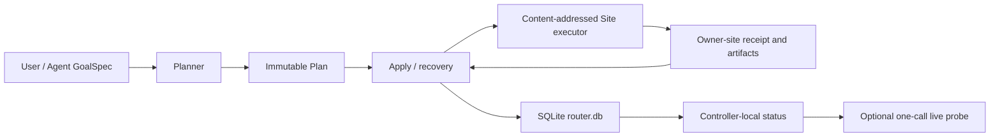

# Entity Router v5 实现说明

日期：2026-07-19
范围：GoalSpec `kind=run` 的完整闭环

## 结果

Router 的普通路径已经从 v3/v4 的 Case、Workflow、Action、Worker、flow request 和
writer lease 驾驶，收敛为三个命令：

```text
entityctl plan → entityctl apply → entityctl status
```

用户和主 Agent 只写运行目标与资源承诺。Case UID、Operation/run ID、source/input hash、
Site/path Locator、staging/run root、Step、claim、receipt 和恢复判断全部由程序派生。

## 当前架构



Controller 只保存小型控制事实。源码、build、run、raw data 和 analysis artifact 仍由各自
Site 权威保存。

## 实现映射

| 模块 | 职责 |
|---|---|
| `entity_router_planner.py` | 校验最小 GoalSpec，固定完整源码内容身份，派生不可变 Plan |
| `entity_router_store.py` | SQLite schema、事务、Operation/Step journal、identity/current、v3 import/export |
| `entity_router_operation.py` | Apply、内部 claim heartbeat、Local/SSH staging、恢复、status |
| `entity_router_executor.py` | 站点侧 allowlisted preflight/prepare/launch、receipt、独立 verify |
| `entityctl.py` | 公开 `plan/apply/status` 与管理面 `doctor/install/migrate` |

公共 `--help` 只展示这六个入口。旧 flow、writer、project、inspect 和 run-status 仍可作为
兼容实现运行，但不再出现在普通接口或 SKILL 上下文。

## 简化后的运行语义

1. `plan` 读取 Goal、Site、项目源码和 input，缺少真正决策时只返回
   `needs_decision`；不创建 Case/Operation。
2. `apply` 重新验证 Plan hash、源码、Site profile 以及全部派生路径和边界，然后创建或
   复用 Operation。
3. 每个 Step 在外部效果前写 intent；Site receipt 绑定 Operation、Plan 和 Step。
4. Executor 完成后，Controller 再调用 verify 读取 receipt 并核对输出 fingerprint，随后
   用一个 SQLite 事务提交 Step、identity、current pointer 和 event。
5. 中断后再次 Apply 同一 Plan。已存在的 receipt 被验证和复用；没有独立 recover 命令。
6. `status` 默认只读 `router.db`。`--live` 只对当前 job 做一次 scheduler 调用。

## 安全边界

- GoalSpec 禁止 ID、hash、Locator、binding、owner/domain、lease 和命令字段。
- Executor 不接收 caller script/shell；只接收严格 `run_spec` 并自行渲染 sbatch。
- 显式 executable 必须位于 Site `build_root`。
- Plan 即使被编辑并重新计算 hash，也不能扩大 allowed root、改变 payload/receipt/run path
  或伪造派生 identity。
- 源码身份包含 tracked、modified、untracked 文件的内容 hash；`dirty=true` 不再充当身份。
- Plan artifact 位于项目内时只排除它自己，不能用排除列表隐藏其他源码变化。
- 同一 launch intent 若匹配多个 Slurm job，Operation 终结为 anomaly，不猜测采用哪个。

## 迁移

`entityctl migrate --from-v3` 一次性导入 v3 site、registry、project binding、Case、identity
与遗留异常线索。数据库记录 `v3_imported_at`；后续调用不重放、不覆盖 v5 状态，也不回写
旧 JSON。`migrate --export` 提供可审计 JSON 导出。

当前真实 controller 尚未执行迁移：`bh-reconnection` 和 `axion-pic` 仍是活跃 v3 Case。
在它们静止且旧客户端会话重启前迁移会有事实分叉风险，因此本次只验证迁移代码和临时
controller，不触碰 live 状态。

## 验收

- Router：101 tests passed。
- `entity-pgen`：3 tests passed。
- `entity-env-build`：18 tests passed。
- v5 专项：15 tests，覆盖 CLI、确定性 Plan、项目根与源码权威根分离、Site policy 决策、重复 Apply 不重复 `sbatch`、三个 Step 的
  effect-before-commit 崩溃恢复、暂时性 SQLite commit 失败、Local/SSH 同构、一次 live call、
  v3 单次迁移和重算 hash 后扩大写根的篡改拒绝。
- 新增运行文件通过 Python 3.6 grammar 解析与当前 Python bytecode compile。
- `git diff --check` 通过。
- 真实 SSH canary：`pi2-v100`，Python 3.12.2，Slurm；内容寻址 executor 成功远端执行并
  verify `run.preflight.v1`。最终 executor SHA-256 为
  `eb29e74306890c70848824e4d63d2e3d20cb2aa26494216344ba5a1138da9a3a`。使用确认的
  `dgx2` partition，仅调用 `sbatch --test-only`，没有提交作业。receipt 位于
  `/lustre/home/acct-tdlmzn/tdlmzn-yangyangcai/entity/axion-pic/_router-stage/.v5-canary/2026-07-19-final/`。

真实 canary 同时发现现有 `pi2-v100` profile 缺少 `policy.default_partition` 和
`policy.default_submit_user`。`doctor` 现在会显式报告这两项；Planner 在 Site/Goal 都没有
给出时返回 `needs_decision`，不会把错误推迟到 Apply。

## 明确边界

v5 当前完整执行的 Goal kind 是 `run`。PGen、build、data、analysis 继续由三个 owner skill
承担领域工作，并遵循“自由探索，严格收束”；把它们全部纳入同一 GoalSpec 外层合同是后续
扩展，不应通过重新暴露 Action/flow 细节来实现。
