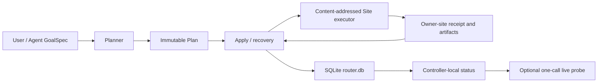

# Entity Router v5 Implementation Notes

Date: 2026-07-19
Scope: the complete closed loop for GoalSpec `kind=run`

## Results

The Router's normal path has converged from the v3/v4 model driven by Case, Workflow,
Action, Worker, flow request, and writer lease down to three commands:

```text
entityctl plan → entityctl apply → entityctl status
```

The user and the main Agent only write run goals and resource commitments. Case UID,
Operation/run ID, source/input hash, Site/path Locator, staging/run root, Step, claim,
receipt, and recovery decisions are all derived by the program.

## Current Architecture



The Controller stores only small control facts. Source code, builds, runs, raw data, and
analysis artifacts remain authoritatively stored on their respective Sites.

## Implementation Mapping

| Module | Responsibility |
|---|---|
| `entity_router_planner.py` | Validate the minimal GoalSpec, pin the full source content identity, derive the immutable Plan |
| `entity_router_store.py` | SQLite schema, transactions, Operation/Step journal, identity/current, v3 import/export |
| `entity_router_operation.py` | Apply, internal claim heartbeat, Local/SSH staging, recovery, status |
| `entity_router_executor.py` | Site-side allowlisted preflight/prepare/launch, receipt, standalone verify |
| `entityctl.py` | Public `plan/apply/status` plus management-plane `doctor/install/migrate` |

The public `--help` shows only these six entry points. The old flow, writer, project,
inspect, and run-status commands still run as compatibility implementations, but no
longer appear in the normal interface or the SKILL context.

## Simplified Run Semantics

1. `plan` reads the Goal, Site, project source, and input; when a genuine decision is
   missing it returns only `needs_decision`; it does not create a Case/Operation.
2. `apply` re-validates the Plan hash, source, Site profile, and all derived paths and
   boundaries, then creates or reuses an Operation.
3. Each Step writes an intent before its external effect; the Site receipt binds the
   Operation, Plan, and Step.
4. After the Executor finishes, the Controller calls verify to read the receipt and
   check the output fingerprint, then commits the Step, identity, current pointer, and
   event in a single SQLite transaction.
5. After an interruption, Apply the same Plan again. Existing receipts are verified and
   reused; there is no separate recover command.
6. `status` by default reads only `router.db`. `--live` makes at most one scheduler call
   for the current job.

## Security Boundaries

- GoalSpec forbids ID, hash, Locator, binding, owner/domain, lease, and command fields.
- The Executor accepts no caller script/shell; it accepts only a strict `run_spec` and
  renders the sbatch itself.
- An explicit executable must be located under the Site `build_root`.
- Even if a Plan is edited and its hash recomputed, it cannot widen the allowed root,
  change payload/receipt/run paths, or forge derived identity.
- Source identity includes content hashes of tracked, modified, and untracked files;
  `dirty=true` no longer serves as identity.
- A Plan artifact located inside the project excludes only itself; exclusion lists cannot
  be used to hide other source changes.
- If a launch intent matches multiple Slurm jobs, the Operation terminates as an anomaly
  rather than guessing which one to adopt.

## Migration

`entityctl migrate --from-v3` performs a one-time import of v3 sites, registry, project
bindings, Cases, identities, and legacy anomaly clues. The database records
`v3_imported_at`; later calls do not replay, do not overwrite v5 state, and do not write
back to the old JSON. `migrate --export` provides an auditable JSON export.

The real controller has not yet executed the migration: `bh-reconnection` and
`axion-pic` are still active v3 Cases. Migrating before they go quiet and old client
sessions restart would risk fact divergence, so this round only validated the migration
code against a temporary controller without touching live state.

## Acceptance

- Router: 101 tests passed.
- `entity-pgen`: 3 tests passed.
- `entity-env-build`: 18 tests passed.
- v5-specific: 15 tests, covering the CLI, deterministic Plans, separation of project
  root and source authority root, Site policy decisions, repeated Apply not repeating
  `sbatch`, effect-before-commit crash recovery at all three Steps, transient SQLite
  commit failure, Local/SSH isomorphism, a single live call, one-time v3 migration, and
  rejection of tampering that widens the write root after recomputing the hash.
- Newly added run files pass Python 3.6 grammar parsing and current Python bytecode
  compilation.
- `git diff --check` passes.
- Real SSH canary: `pi2-v100`, Python 3.12.2, Slurm; the content-addressed executor
  executed remotely and verified `run.preflight.v1`. Final executor SHA-256:
  `eb29e74306890c70848824e4d63d2e3d20cb2aa26494216344ba5a1138da9a3a`. Used the confirmed
  `dgx2` partition, invoked only `sbatch --test-only`, and submitted no jobs. The receipt
  is located at
  `/lustre/home/acct-tdlmzn/tdlmzn-yangyangcai/entity/axion-pic/_router-stage/.v5-canary/2026-07-19-final/`.

The real canary also revealed that the existing `pi2-v100` profile lacks
`policy.default_partition` and `policy.default_submit_user`. `doctor` now reports both
explicitly; the Planner returns `needs_decision` when neither the Site nor the Goal
provides them, instead of deferring the error to Apply.

## Explicit Boundaries

The only Goal kind v5 currently executes end to end is `run`. PGen, build, data, and
analysis remain the domain work of the three owner skills, following "explore freely,
converge strictly"; bringing them all under the same GoalSpec outer contract is a later
extension and must not be achieved by re-exposing Action/flow details.

## Retirement Record (2026-07-21)

The v3/v4 code surface has been fully deleted: `entity_router_state.py`,
`entity_router_flow*.py`, `entity_router_status.py`, `entity_router_project.py`,
`entity_router_site.py`, the entityctl compatibility commands (`flow`, `writer`,
`project`, `inspect`, `run-status`, `migrate --from-v3`), the v3/v4 templates and all
playbooks, and the `evals/router-flow/` v4 evaluation scaffolding. `migrate --export` was
replaced by `entityctl export --output`; Site registration is now handled by
`entityctl site add/list` (writing directly to the v5 store), replacing
`entity_router_site.py`.

The v3 import into the production controller `~/.entity-router` completed on 2026-07-19
(4 Cases, 2 Projects, 7 Sites); a 2026-07-21 re-check of `doctor` and `status` for the
two active projects showed everything normal; the backup is at
`~/.entity-router.backup-20260721-132112/` (including the `v5-export.json` snapshot).
The old v3 files are retained in place as read-only evidence per the migration semantics;
v5 no longer reads them.

`entity-pgen` preflight now queries the v5 store; managed writes are fail-closed
(`router-required`) until the v5 pgen Goal lands, while read-only and standalone paths
are unchanged.
